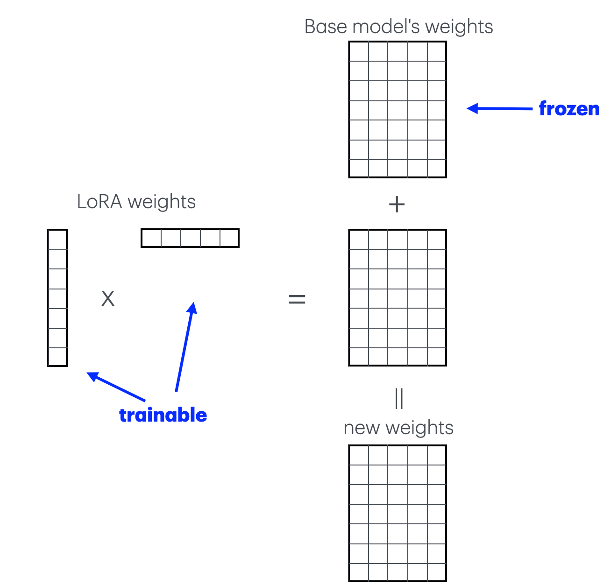
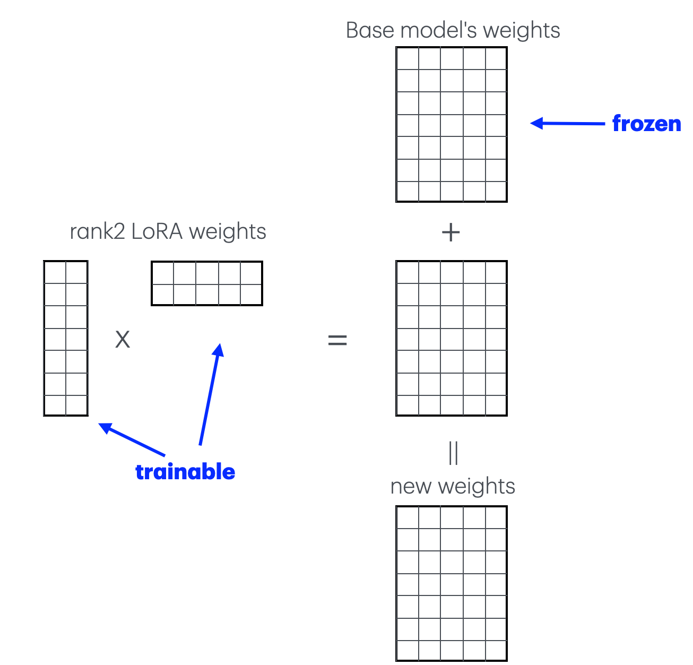
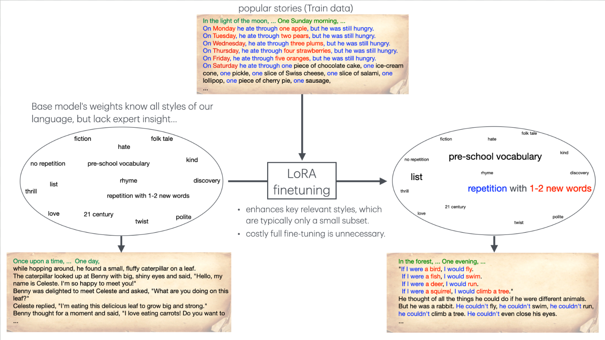

# Low-Rank Adaptation (LoRA) of Large Language Models (LLMs)
This [notebook](./QLoRA_with_Unsloth.ipynb) provides an example of how to finetune LLMs using LoRA. Here, we will apply LoRA so that a model (Meta Llama 3.1 8B Instruct) generates stories appropriate for one- to three-year-old children.

LoRA is a [Parameter-Efficient Fine-Tuning](https://huggingface.co/docs/peft/en/index) method that is very effective. In this method, the original model's weights are unchanged, and only a small amount of trainable weights are introduced to form low-rank tensors, which are added to the original weights as shown below:     

When you want to introduce more trainable weights, you just increase the rank like this:

See the seminal paper [LoRA: Low-Rank Adaptation of Large Language Models](https://arxiv.org/abs/2106.09685) by Hu et al.

